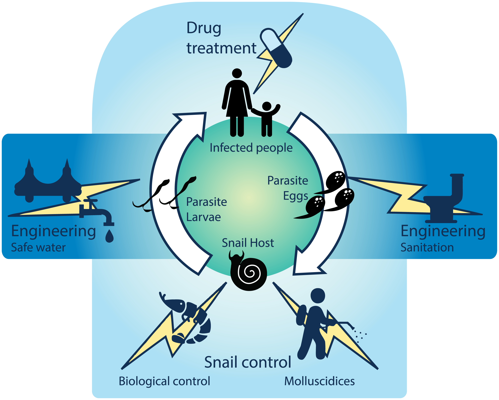
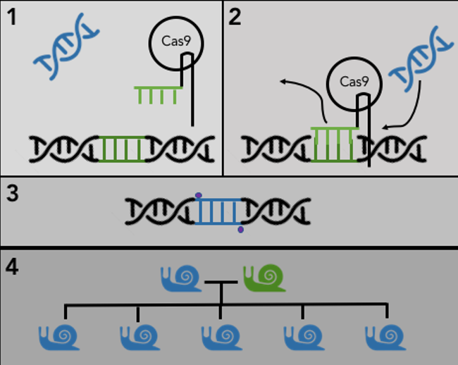
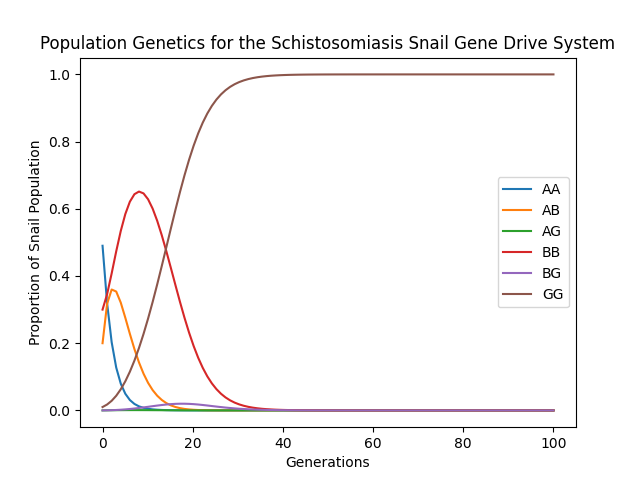
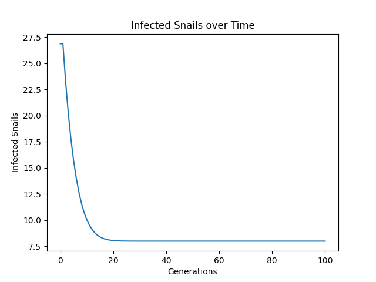

## About Schistosomiasis

Schistosomiasis (SHI-stow-so-MY-ah-sis) is a parasitic worm disease that affects over 200 million people a year. Schistosomiasis is most common in areas in sub-Saharan Africa without access to clean water or sanitation.  Schistosomiasis is characterized by high morbidity and relatively low mortality , meaning that people with schistosomiasis becomne chronically ill but don't usually die. Schistosomiasis is considered a Neglected Tropical Disease and a disease of poverty.

The parasitic larvae enter the bloodstream when people come into contact with infested water. Once in the body, the larvae mature into worms, reside in either the urinary or gastrointestinal system, start to lay spiky eggs that are painfully excreted out of the body. When these eggs enter water, they hatch and infect freshwater snails. Inside the snails, the larvae develop until they are ready to emerge and infect humans, thus continuing the worm's life cycle.

## Interventions

Schistosomiasis can be prevented in several ways along the schistosome life cycle, as shown in **Figure 1.** Clean water and sanitation prevents worm larvae from reaching humans and prevents egg-infested excrement from reaching the snails, but is difficult to implement. Adult worms in humans can be treated with the anti-parasite drug praziquantel, but this drug does not prevent reinfection from contaminated waters. Finally, targeting the intermediate snail host can reduce the amount of worm larvae able to infect humans. The snail population can be controlled with molluscicides, habitat control, biological control, and, theoretically, through gene drives.

Fix this - take a screenshot of the cycle but sized correctly, insert it

<p align="center"></p>

**Figure 1.** Schistosome life cycle, with intervention points labeled as lightning bolts. Reproduced with permission from Sokolow 2016.


## Gene Drives

Gene drives propagate a target gene through a population at a rate higher than the expected level of Mendelian inheritance. For example, let's say that Parent 1 carries Gene A and Parent 2 carries Gene G. Normally, the chance of inheriting Gene G from a parent is 50%, but if a gene drive is paired with Gene G, the chance becomes much higher - often close to 100%. With the advent of CRISPR/Cas9 gene editing technology, many different gene drive constructs are being explored within the realm of infectious disease control. Some gene drives focus on spreading a lethal gene through, for example, a mosquito population - acting as a sort of genetic pesticide and locally crashing a population. Other gene drives focus on spreading disease resistance through a population, making a disease less transmissible to humans, but otherwise leaving the population mostly intact.

Here, we explore the second scenario within the intermediate snail host of schistosomiasis, as shown in **Figure 2.** These snails exhibit a behavior called *selfing,* a type of asexual reproduction, so one of the goals of this modeling exercise is to see how selfing impacts gene drive outcomes.

<p align="center"></p>

**Figure 2.** CRISPR-Cas9-intermediated gene drive in the intermediate snail host for schistosomiasis. 1) The Cas9 construct is paired with a desired gene and inserted into the snail. 2) Cas9 and the guide RNA pair to its complementary DNA strand, creating a gap where the desired gene can be inserted. 3) The desired gene is now fully inserted into the genome, and enzymes heal the cuts. 4) Snails carrying the Cas9 construct and desired gene mate with wild type snails, such that all (or nearly all) of the offspring carry both the gene drive and desired gene. The desired gene makes its way through the snail population at super-Mendelian rates (i.e. >50% inheritance rates).

To put it another way, let's say we have a wild-type snail with genotype AA mate with an engineered snail of genotype GG. With normal inheritance rules, and using Punnett square logic, we get:

$$AA \times GG \to 100\% AG$$

But with the gene drive, the $A$ allele in the $AG$ genotype becomes overwritten, so all, or nearly all offspring have genotype $GG$

## Setup and Model Assumptions

To model this situation, we start by establishing some constants. These are the building blocks for this scenario. Where applicable, literature sources for the parameters are listed. These characteristics are specific to *Biomphalaria glabrata.* In this scenario, we have three alleles:

**Allele A:** Mendelian inheritance and no resistance to schistosome infection \
**Allele B:** Mendelian inheritance and resistance to schistosome infection \
**Allele G:** super-Mendelian inheritance and resistance to schistosome infection

Resistance to disease often comes at a cost to fecundity or competitive ability. For this model's purposes, the resistant alleles B and G carry a fitness cost that impacts growth rate. Allele G has an additional fitness cost as a result of carrying the gene drive. Finally, snails that are infected have a severe fitness cost, since schistosome infection castrates the snail.


```python
import numpy as np
import pandas as pd
import math


# Intrinsic growth rate (clutch size), per snail per generation
# Source = Costa 2004
R = 54

# Natural death rate, per generation
# Source = Woolhouse 1991
MU = 0.2

# Gene drive efficiency
# Source = Hammond et al. 2016
G = 0.95

# Selfing rate
# Source = Jarne 1993
SIG = 0.15

# Cost of inbreeding
# Source = Costa 2004
INBR = .85  

# Per capita infection rate of snails by a female worm
# Source = Sokolow 2015 (beta = 0.000004), then calibrated to expected infection prevalence
BETA = 0.5

# Level of resistance conveyed by both B and G
XI = 0.8

# Carrying capacity
K = 100

# Defining alleles and genotypes
alleles = ["A", "B", "G"] 
N_ALLELES = len(alleles)
allele_growth_rates = [R, R*0.9, R*0.8] # B's growth rate is 90% of A. G's is 80% of A
allele_resistances = [0, XI, XI] # B and G assumed to convey the same resistance
# add allele resistances
genotypes = []
genotype_growth_rates = []
genotype_resistances = []
for i in range(0, N_ALLELES):
    for j in range(i, N_ALLELES):
        genotypes.append(alleles[i]+alleles[j])
        genotype_growth_rates.append(np.mean([allele_growth_rates[i],
                                              allele_growth_rates[j]]))
        genotype_resistances.append(np.mean([allele_resistances[i],
                                             allele_resistances[j]]))
N_GENOTYPES = len(genotypes)

# Population dynamics setup
# Number of snail generations to track. Default = 100
N_GENS = 100

# Define initial (starting) snail population for the genotypes [AA, AB, AG, BB, BG, GG]
# Assuming we seed a population with 1 gene drive individual, Default = [49, 20, 0, 30, 0, 1]
initial_pop = [49, 20, 0, 30, 0, 1]

# Define the population genetics matrix. We'll use this to graph out the population over several generations
population_genetics = np.zeros([N_GENOTYPES, N_GENS])

# Initialize the population
population_genetics[:,0] = initial_pop

# Creating an empty array for the number of infected snails
infected_snails = np.zeros((N_GENS, N_GENOTYPES))
for x in range(0, N_GENOTYPES):
    infected_snails[0][x] = (1 - MU) * BETA * (1 - genotype_resistances[x]) * initial_pop[x]
```

Now let's take a look at the characteristics of the genotypes we are working with:


```python
# View characteristics of the genotypes we are working with
# don't forget to add resistance
gdf = pd.DataFrame({"Growth Rate": genotype_growth_rates,
                   "Resistance": genotype_resistances})
gdf.index = genotypes
gdf
```


<div>
<style scoped>
    .dataframe tbody tr th:only-of-type {
        vertical-align: middle;
    }

    .dataframe tbody tr th {
        vertical-align: top;
    }

    .dataframe thead th {
        text-align: right;
    }
</style>
<table border="1" class="dataframe">
  <thead>
    <tr style="text-align: right;">
      <th></th>
      <th>Growth Rate</th>
      <th>Resistance</th>
    </tr>
  </thead>
  <tbody>
    <tr>
      <th>AA</th>
      <td>54.0</td>
      <td>0.0</td>
    </tr>
    <tr>
      <th>AB</th>
      <td>51.3</td>
      <td>0.4</td>
    </tr>
    <tr>
      <th>AG</th>
      <td>48.6</td>
      <td>0.4</td>
    </tr>
    <tr>
      <th>BB</th>
      <td>48.6</td>
      <td>0.8</td>
    </tr>
    <tr>
      <th>BG</th>
      <td>45.9</td>
      <td>0.8</td>
    </tr>
    <tr>
      <th>GG</th>
      <td>43.2</td>
      <td>0.8</td>
    </tr>
  </tbody>
</table>
</div>


## The Transition Matrix

The goal of this model is to observe how the population genetics of a snail population change over time (measured in generations of snails). To do this, we set up a transition matrix (Grewelle et al. 2022), which tracks how genotypes change from one generation to the next. The transition matrix is the probability that the genotypes in the rows will reproduce and make the genotypes in the columns in the subsequent generation. The following function constructs the matrix by examining all combinations of genotype crossings.


```python
def get_transition_matrix(genotypes, previous_gen_proportions):
    # Framing the proportions in a dataframe we can call by genotype
    proportions = pd.DataFrame(previous_gen_proportions, index = genotypes)
    
    # Outcrossing transition matrix setup
    out_tm = np.zeros((N_GENOTYPES, N_GENOTYPES))
    out_tm = pd.DataFrame(out_tm, index = genotypes, columns = genotypes)
    
    # Generating the outcrossing transition matrix
    # genotype1 x genotype 2 --> genotype_nextgen
    # transition matrix rows: genotype1, column: genotype_nextgen
    for genotype1 in genotypes:
        for genotype2 in genotypes:
            for allele1 in genotype1:
                for allele2 in genotype2:
                    genotype_nextgen = allele1 + allele2
                    genotype_nextgen = "".join(sorted(genotype_nextgen)) # alphabetize the genotype
                    rate = np.mean([gdf.loc[genotype1]["Growth Rate"], gdf.loc[genotype2]["Growth Rate"]])
                        
                    # Gene Drive Condition:
                    # If the nextgen genotype is heterozygous for the gene drive,
                    # then the efficiency rate g determines the outcomes
                    # - Most form a gene drive genotype 'GG' at a rate g
                    # - Some stay in the nextgen genotype at a rate (1-g)
                    if bool('G' in allele1) != bool('G' in allele2):
                        out_tm["GG"][genotype1] = out_tm["GG"][genotype1] + G * (1 / 4) * rate * proportions.loc[genotype1][0] * proportions.loc[genotype2][0]
                        out_tm[genotype_nextgen][genotype1] = out_tm[genotype_nextgen][genotype1] + (1 - G) * (1 / 4) * rate * proportions.loc[genotype1][0] * proportions.loc[genotype2][0]
                    else:
                        out_tm[genotype_nextgen][genotype1] = out_tm[genotype_nextgen][genotype1] + (1 / 4) * rate * proportions.loc[genotype1][0] * proportions.loc[genotype2][0]
    
    # Selfing (asexual reproduction) transition matrix setup
    self_tm = np.zeros((N_GENOTYPES, N_GENOTYPES))
    self_tm = pd.DataFrame(self_tm, index = genotypes, columns = genotypes)

    # Generating the selfing transition matrix
    # genotype1 x genotype 1 --> genotype_nextgen
    # transition matrix rows: genotype1, column: genotype_nextgen
    for genotype_self in genotypes:
        for allele1 in genotype_self:
            for allele2 in genotype_self:
            
                # Find the genotype we're working with and alphabetize it
                genotype_nextgen = allele1 + allele2
                genotype_nextgen = "".join(sorted(genotype_nextgen))
                rate = gdf.loc[genotype_self]["Growth Rate"]
            
                # Gene Drive Condition applies
                if bool ('G' in allele1) != bool('G' in allele2):
                    self_tm['GG'][genotype_self] = self_tm['GG'][genotype_self] + G * (1 / 4) * rate * proportions.loc[genotype_self][0]
                    self_tm[genotype_nextgen][genotype_self] = self_tm[genotype_nextgen][genotype_self] + (1 - G) * (1 / 4) * rate * proportions.loc[genotype_self][0]
                else:
                    self_tm[genotype_nextgen][genotype_self] = self_tm[genotype_nextgen][genotype_self] + (1 / 4) * rate * proportions.loc[genotype_self][0]
    
    # Combine the two transition matrices, applying the selfing rate and the inbreeding cost
    tm = (1 - SIG) * out_tm + SIG * INBR * self_tm
    
    return tm
```


```python
# Starting with index of 1 because we have generation 0 already defined
for i in range(1, N_GENS):    
    # Apply natural death and infection-caused castration to get to the reproducing pool of snails
    reproducing_population = np.zeros(N_GENOTYPES)
    for x in range(0, N_GENOTYPES):
            infected_snails[i][x] = (1 - MU) * BETA * (1 - gdf.loc[genotypes[x]]["Resistance"]) * population_genetics[x, i-1]
            reproducing_population[x] = population_genetics[x, i-1] - MU * population_genetics[x, i-1] - infected_snails[i][x]

    # The last element is the total number of snails in the population
    total_repr_pop = np.sum(reproducing_population)
    
    # get a proportion - this is now the probability of encountering the genotype during this generation
    genotype_proportions = reproducing_population/total_repr_pop
    
    tm =  get_transition_matrix(genotypes, genotype_proportions)

    # Find total amount of new growth, by genotype, and in total
    genotype_growth = np.sum(tm)
    growth_total = np.sum(genotype_growth)

    # apply a coefficient for logistic growth
    log_growth_coeff = total_repr_pop * K / (total_repr_pop + (K - total_repr_pop) * math.exp(-growth_total)) - total_repr_pop
    
    # new population = reproducing (surviving) population + new births
    new_pop = reproducing_population + genotype_growth/growth_total*log_growth_coeff

    # probably some if statement to set new_pop = 0 if negative
    
    population_genetics[:,i] = new_pop

# Convert population genetics to proportions for plotting purposes
for i in range(0, N_GENS):
    population_genetics[:,i] = population_genetics[:,i]/np.sum(population_genetics[:,i])

```

## Plotting Out the Genotypes

Now, we can observe how the genotypes change over several generations. If the gene drive works well, then the proportion of snails homozygous for the gene drive (genotype $GG$) should rise fairly quickly.


```python
import matplotlib.pyplot as plt

# Make the time axis
t = np.linspace(0, N_GENS, N_GENS)

# Plot each genotype abundance
for x in range(0, N_GENOTYPES):
    plt.plot(t,population_genetics[x,:], label = genotypes[x])
plt.legend()
plt.title("Population Genetics for the Schistosomiasis Snail Gene Drive System")
plt.xlabel("Generations")
plt.ylabel("Proportion of Snail Population")
plt.show()
```


    

    


We should also observe a decrease in the number of infected snails as time goes on:


```python
infections_to_plot = np.zeros(N_GENS)
for x in range(0, N_GENS):
    infections_to_plot[x] = np.sum(infected_snails[x,:])

plt.plot(t,infections_to_plot)
plt.xlabel("Generations")
plt.ylabel("Infected Snails")
plt.title("Infected Snails over Time")
plt.show()

# One might ask - why don't snail infections completely drop to 0?
# Answer: while the gene drive may dominate a population, it still only provides partial protection from infection
```


    

    


## Conclusion

This exercise demonstrated a theoretical system where a gene drive is applied to a population of freshwater snails that serve as the intermediate host for schistosomiasis. Freshwater snails reproduce both sexually and asexually, so modeling a gene drive in this system is of special interest. For more information about this system and this project, see Grewelle 2021.

### References

Costa MJ, Grault CE, Confalonieri UE. Comparative study of the fecundity and fertility of Biomphalaria glabrata (Say, 1818) and Biomphalaria straminea (Dunker, 1848) in a laboratory through self-fertilization and cross-fertilization. *Rev Inst Med Trop Sao Paulo.* 2004 May-Jun;46(3):157-63. doi: 10.1590/s0036-46652004000300007. Epub 2004 Jul 20. PMID: 15286820.

Grewelle, R.E., Perez-Saez J., Tycko J., Namigai E.K.O., Rickards C.G., De Leo G.A. (2021). Modeling the efficacy of CRISPR gene drive for schistosomiasis control (pre-print). *bioRxiv* 2021.10.29.466423 https://doi.org/10.1101/2021.10.29.466423

Hammond A, Galizi R, Kyrou K, Simoni A, Siniscalchi C, Katsanos D, Gribble M, Baker D, Marois E, Russell S, Burt A, Windbichler N, Crisanti A, Nolan T. A CRISPR-Cas9 gene drive system targeting female reproduction in the malaria mosquito vector Anopheles gambiae. *Nat Biotechnol.* 2016 Jan;34(1):78-83. doi: 10.1038/nbt.3439. Epub 2015 Dec 7. PMID: 26641531; PMCID: PMC4913862.

Jarne, P., & Charlesworth, D. (1993). The Evolution of the Selfing Rate in Functionally Hermaphrodite Plants and Animals. *Annual Review of Ecology and Systematics,* 24, 441–466. http://www.jstor.org/stable/2097186

Sokolow, S. H., Huttinger, E., Jouanard, N., Hsieh, M. H., Lafferty, K. D., Kuris, A. M., Riveau, G., Senghor, S., Thiam, C., N’Diaye, A., Faye, D. S., & De Leo, G. A. (2015). Reduced transmission of human schistosomiasis after restoration of a native river prawn that preys on the snail intermediate host. *Proceedings of the National Academy of Sciences*, 112(31), 9650–9655. https://doi.org/10.1073/pnas.1502651112

Sokolow, S. H., Wood, C. L., Jones, I. J., Swartz, S. J., Lopez, M., Hsieh, M. H., Lafferty, K. D., Kuris, A. M., Rickards, C., & Leo, G. A. D. (2016). Global Assessment of Schistosomiasis Control Over the Past Century Shows Targeting the Snail Intermediate Host Works Best. *PLOS Neglected Tropical Diseases*, 10(7), e0004794. https://doi.org/10.1371/journal.pntd.0004794

Woolhouse, M., Taylor, P., Matanhire, D. et al. Acquired immunity and epidemiology of Schistosoma haematobium. *Nature* 351, 757–759 (1991). https://doi.org/10.1038/351757a0

World Health Organization (2022). Schistosomiasis. Retrieved October 8, 2022, from https://www.who.int/news-room/fact-sheets/detail/schistosomiasis

